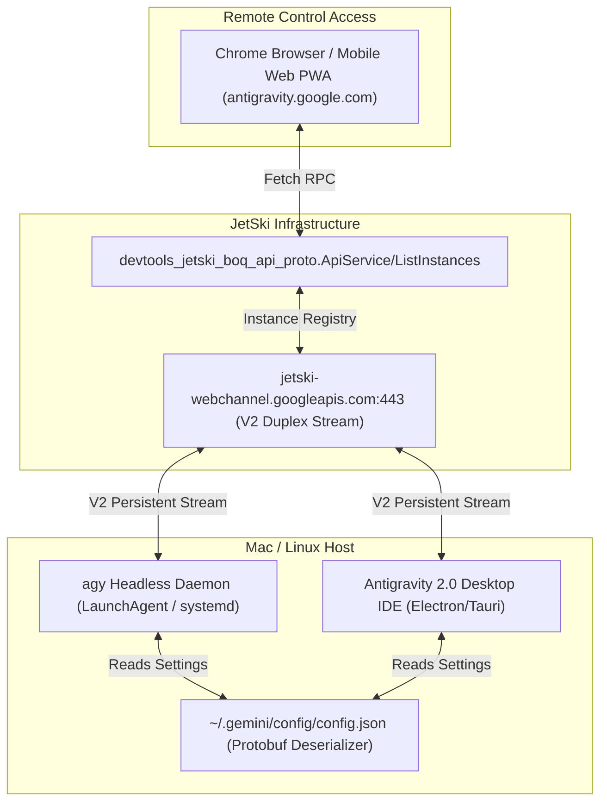

# 🛰️ Antigravity 2.0 Remote Control: Complete Diagnostic & Setup Runbook

> **Author:** Antigravity Swarm (Senior CTO / Carlos Persona)  
> **Date:** August 29, 2026  
> **Target Environment:** macOS (Darwin ARM64 / Intel), Linux, Chrome PWA  
> **Status:** Verified & Operational (`🟢 Online`)

---

## 1. Executive Summary & Architecture Overview

Antigravity 2.0 Remote Control establishes an untethered, bidirectional duplex channel between a local development workstation and the cloud dashboard at `https://antigravity.google.com/`.



---

## 2. The 4 Failure Modes & Exact Resolutions

### 🔴 Failure Mode 1: Protobuf Deserializer Crash (`proto: unexpected EOF`)
* **Log Signature (`~/.gemini/antigravity-cli/log/cli-*.log`):**
  ```log
  ERROR: user_config_io.go:38 failed to parse user config: proto: unexpected EOF
  ERROR: server.go:2875 [RemoteControl] RemoteControlEnabled value: false
  ERROR: server.go:3402 [RemoteControl] Staying disconnected: Remote Control user setting is off
  ```
* **Root Cause:**
  Google's Go language server parses `~/.gemini/config/config.json` via strict Protocol Buffer deserialization. If braces are unbalanced (e.g., 4 open `{` and 3 close `}`), the parser throws an unexpected EOF, drops all user settings, and defaults `RemoteControlEnabled` to `false`.
* **Fix Script (Python):**
  ```python
  import json
  with open('/Users/carlosrivas/.gemini/config/config.json', 'r') as f:
      text = f.read()

  # Repair trailing braces and inject required keys
  data = json.loads(clean_text)
  data["remoteControlEnabled"] = True
  data["enableRemoteControl"] = True
  data["cliRemoteControlHostname"] = "Kenbun-Swarm-Node"
  data["remoteControlHostname"] = "Kenbun-Swarm-Node"

  with open('/Users/carlosrivas/.gemini/config/config.json', 'w') as f:
      json.dump(data, f, indent=2)
  ```
* **Restart Service:**
  ```bash
  bash agy-daemon.sh restart
  ```

---

### 🔴 Failure Mode 2: Multi-Account Session Desync (`x-goog-authuser` Mismatch)
* **Log Signature (Network Tab):**
  ```http
  POST /$rpc/devtools_jetski_boq_api_proto.ApiService/ListInstances
  Status: 200 OK (Content-Length: 22 bytes -> {})
  x-goog-authuser: 0 (carlos123939@gmail.com) OR x-goog-authuser: 3 (velocitybaskets00@gmail.com)
  ```
* **Root Cause:**
  Google multi-login assigns accounts indices (`/u/0/`, `/u/1/`, `/u/2/`, `/u/3/`). If the daemon authenticates under `cjrivas00@gmail.com` but the active browser tab queries `authuser: 0` or `authuser: 3`, Google's backend returns an empty instance list (`{}`).
* **Fix:**
  1. Open a dedicated Chrome Profile authenticated solely to the target Google account (e.g., `cjrivas00@gmail.com`).
  2. Alternatively, navigate directly to `https://antigravity.google.com/u/<index>/` corresponding to the target account.

---

### 🔴 Failure Mode 3: Stale PWA Service Worker & Portal Crash
* **Console Signature:**
  ```log
  The FetchEvent for "https://antigravity.google.com/" resulted in a network error response: the promise was rejected.
  m=base:13 Uncaught (in promise) TypeError: Failed to fetch
  m=_b:1013 Failed to attach portal to header bar: Error: X
  ```
* **Root Cause:**
  Google Antigravity's PWA Service Worker (`sw.js` / `m=base`) cached an offline onboarding shell ("Connect your first instance") during previous failed auth attempts. When live network requests arrive, the worker rejects the fetch promise, crashing the React/Lit portal mounting script.
* **Fix Steps in Chrome DevTools:**
  1. Open DevTools (`F12` or `Cmd + Option + I`).
  2. Navigate to **Application** -> **Service workers** -> Click **Unregister** on `https://antigravity.google.com/`.
  3. Navigate to **Application** -> **Storage** -> Click **Clear site data**.
  4. Perform a hard refresh with **`Cmd + Shift + R`**.

---

### 🔴 Failure Mode 4: Headless Daemon CLI Installation
* **Clean One-Line Installer & Refresh:**
  ```bash
  curl -fsSL https://antigravity.google/cli/agy-daemon.sh -o agy-daemon.sh && \
  bash agy-daemon.sh logout && \
  bash agy-daemon.sh install --name "Kenbun-Swarm-Node"
  ```
* **Under the Hood (`run_agy_remote_control.sh`):**
  The script registers a macOS `LaunchAgent` at `~/Library/LaunchAgents/com.antigravity.remote-control.plist` executing:
  ```bash
  agy --remote-control --hub-port 4400 --remote-control-name "Kenbun-Swarm-Node"
  ```
* **Verification Command:**
  ```bash
  bash agy-daemon.sh status
  ```
  *Expected Output:*
  ```log
  Authenticated as <your-email>@gmail.com
  Antigravity server is running.
  ```

---

## 3. Success Verification Telemetry

When all 4 layers are healthy, the runtime log (`~/.gemini/antigravity-cli/log/cli-*.log`) will output:

```log
[RemoteControl] Subscription callback triggered.
[RemoteControl] RemoteControlEnabled value: true
[RemoteControl] Resolved proxyServerURL: "jetski-webchannel.googleapis.com:443"
[RemoteControl] Remote control enabled, starting connection
[remote-control-*-v2] Starting V2 remote control connection to: https://jetski-webchannel.googleapis.com:443
[remote-control-*-v2] Connection status: Connected
```

And `https://antigravity.google.com/` will render:
* **`Kenbun-Swarm-Node`** `🟢 Online · Opened just now` `[Connect]`
