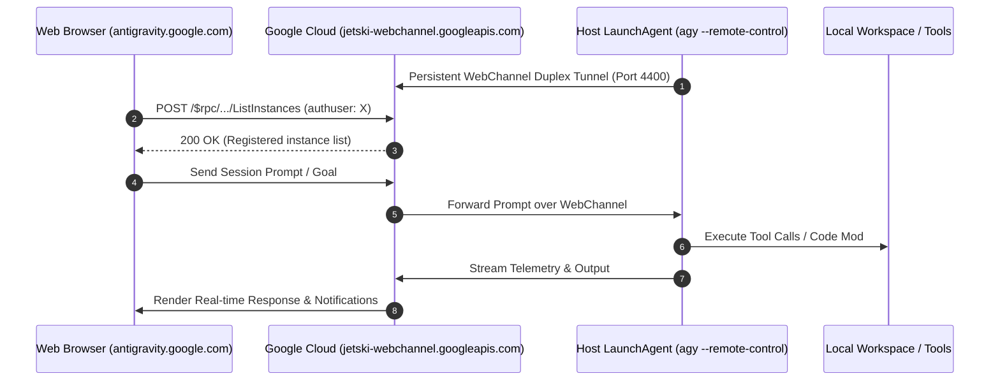

# Antigravity Remote Control Architecture & Troubleshooting Guide

Google Antigravity Remote Control (introduced August 2026 with Antigravity 2.0) allows developers to remotely connect to and drive Antigravity CLI (`agy`) sessions running across host machines via `antigravity.google.com`.

---

## 1. System Architecture



### Core Components
1. **Background Daemon (`agy --remote-control`)**:
   - macOS: Managed via `launchd` service `com.antigravity.remote-control.plist` in `~/Library/LaunchAgents/`.
   - Linux: Managed via `systemd` unit `agy-remote-control.service` in `~/.config/systemd/user/`.
   - Launcher Wrapper: `~/.antigravity/bin/run_agy_remote_control.sh`.
   - Log Stream: `~/.antigravity/agy_daemon.log` and `~/.antigravity/logs/cli-*.log`.
2. **Configuration & Auth Tokens**:
   - `~/.gemini/config/config.json`: Stores user preferences, including `cliRemoteControlHostname` and `remoteControlEnabled`.
   - `~/.gemini/jetski-standalone-oauth-token`: Stores standalone OAuth token credentials.

---

## 2. Daemon Setup & Management (`agy-daemon.sh`)

The workspace script [`agy-daemon.sh`](file:///Users/carlosrivas/Dev/Kenbun/agy-daemon.sh) handles installation, auto-updates, and service management.

### Common Operations
```bash
# Check service status and recent connection logs
./agy-daemon.sh status

# Restart daemon to apply config or port changes
./agy-daemon.sh restart

# Full setup / re-authentication
./agy-daemon.sh setup --name "Kenbun-Swarm-Node"

# Uninstall daemon service
./agy-daemon.sh uninstall
```

### Dynamic Port Probing in Wrapper Launcher
To avoid port conflicts on reboots, `~/.antigravity/bin/run_agy_remote_control.sh` dynamically probes ports 4400-4500:
```bash
#!/bin/bash
AGY_BIN="${HOME}/.local/bin/agy"
[[ -x "$AGY_BIN" ]] || AGY_BIN=$(command -v agy)

PORT=4400
while (( PORT < 4500 )) && (exec 3<>"/dev/tcp/127.0.0.1/${PORT}") 2>/dev/null; do
    PORT=$((PORT + 1))
done
exec "$AGY_BIN" --remote-control --hub-port "$PORT" --remote-control-name "Kenbun-Swarm-Node" "$@"
```

---

## 3. Troubleshooting & Known Resolutions

### Issue 1: Multi-Account Google Profile Mismatch (`ListInstances` Empty)
- **Symptom:** The daemon is active and authenticated, but `antigravity.google.com` displays *"Connect your first instance"* with 0 instances found.
- **Root Cause:** Chrome multi-account routing sends RPCs with `x-goog-authuser: N` (corresponding to `/u/N/` in the URL). If your browser is focused on Account 3 (`velocitybaskets00@gmail.com`) while `agy` was authenticated under Account 0 (`cjrivas00@gmail.com`), Google queries the wrong account pool and returns `{ instances: [] }`.
- **Resolution:**
  1. Click the Google profile icon in the top right of `antigravity.google.com`.
  2. Switch to the exact Google account authenticated in `agy` (e.g. `cjrivas00@gmail.com`).
  3. Verify the instance `Kenbun-Swarm-Node` appears immediately in the instance list.

### Issue 2: `config.json` Protobuf EOF Deserialization Crash
- **Symptom:** Daemon starts but logs:
  ```log
  failed to parse user config: proto: unexpected EOF
  [RemoteControl] RemoteControlEnabled value: false
  [RemoteControl] Resolved proxyServerURL: ""
  [RemoteControl] Staying disconnected: Remote Control user setting is off
  ```
- **Root Cause:** Malformed JSON syntax or unbalanced curly braces `{}` in `~/.gemini/config/config.json` causes Google's Go language server Protobuf parser to fail on boot. When the parser fails, `RemoteControlEnabled` defaults to `false`.
- **Resolution:**
  1. Validate and fix JSON formatting in `~/.gemini/config/config.json`.
  2. Ensure the remote control setting is enabled:
     ```json
     {
       "remoteControlEnabled": true
     }
     ```
  3. Restart the daemon: `./agy-daemon.sh restart`.
  4. Verify in `~/.antigravity/agy_daemon.log`:
     ```log
     [RemoteControl] RemoteControlEnabled value: true
     [RemoteControl] Resolved proxyServerURL: "jetski-webchannel.googleapis.com:443"
     [remote-control-*-v2] Connection status: Connected
     ```

### Issue 3: Desktop App vs CLI Daemon Visibility
- **CLI Daemon:** Appears as the headless named node (e.g., `Kenbun-Swarm-Node`).
- **Desktop Application:** To also expose the visual desktop GUI to remote control, open **Settings (`Cmd+,`) -> App tab -> toggle Enable Remote Control**.
