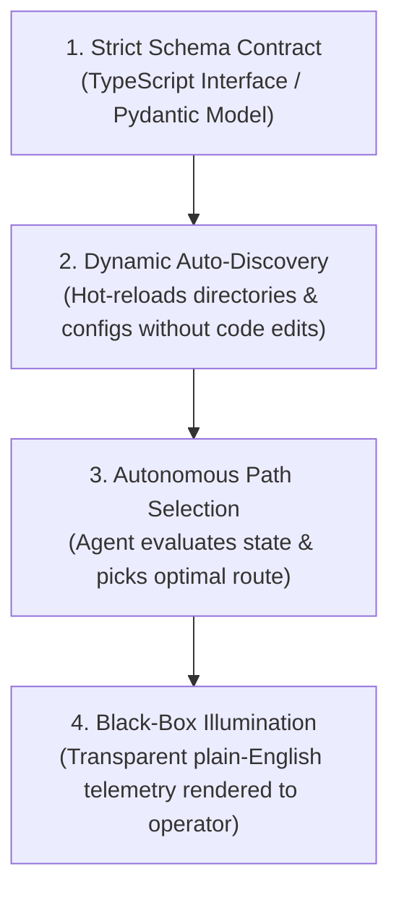

# Dynamic Architecture Sentinel (Black-Box Illumination Protocol)

Autonomous Dynamic Architecture & Observability Standard for Sovereign Agentic Systems.

Version: 1.0.0  
License: MIT

## Purpose

AI systems thrive when bound by **strict schema contracts** while remaining **infinitely dynamic in execution**.

This skill enforces two non-negotiable laws across all codebases (Kenbun, Eko Veritas, NeverMiss, etc.):
1. **Zero-Hardcoding Law**: No static switch/case routers or hardcoded list arrays. Everything must auto-discover dynamically from directory structures, schemas, or configs.
2. **Black-Box Illumination Law**: Every autonomous decision made by an agent must output structured, plain-English telemetry explaining *what* was evaluated, *why* this path was chosen, and *what* happens next.

---

## The 4 Pillars of Dynamic Architecture



---

## Verification & CLI Tool

```bash
# Audit a codebase for hardcoded static anti-patterns:
bin/dynamic-audit /path/to/project
```
