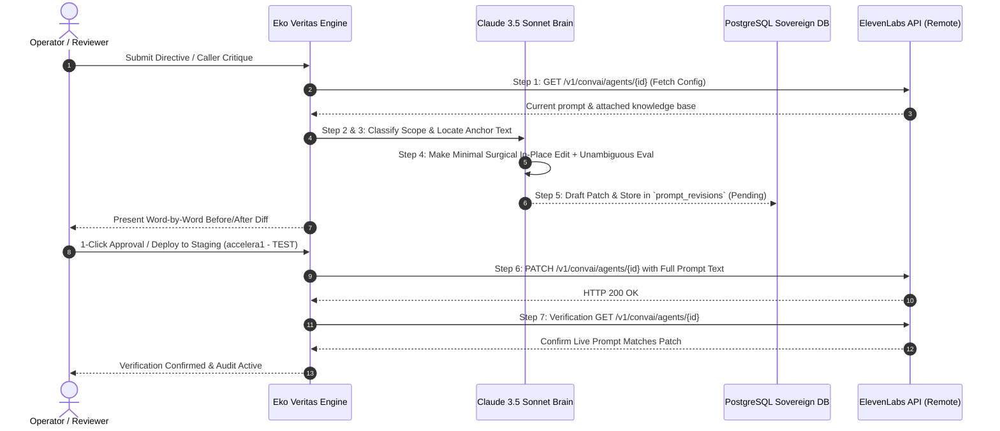

# 🎙️ ElevenLabs Agent Prompt Feedback Skill (Adrian Rodriguez Protocol)

**The Sovereign 7-Step Voice AI Prompt Calibration & Verification Engine**

---

## 🎯 Purpose
Given a piece of user feedback or caller review about how an ElevenLabs Conversational AI agent behaves on a call:
1. Determine whether the fix belongs in the agent’s system prompt text (`conversation_config.agent.prompt.prompt`).
2. If so, apply a precise, minimal surgical patch to that field ONLY.
3. Formulate an unambiguous multi-step evaluation rule to continuously audit the standard on future calls.
4. Verify the change in production with a mandatory follow-up `GET` request.

---

## 🛑 Scope Boundaries (Strict Guardrails)

### ✅ IN SCOPE (What you modify):
Any feedback whose fix is a change to the wording, instructions, facts, or logic contained in `conversation_config.agent.prompt.prompt` — the free-text system prompt the agent reasons from every turn:
* Missing product facts, kit components, or hardware specs.
* Wrong company/persona names or location disclosures.
* Specific instructions to ask or NOT ask something.
* Call-flow ordering and qualification stages.
* Tone, cadence, and brevity adjustments.
* Compliance guardrail additions & anti-pattern prohibitions.

### 🚫 OUT OF SCOPE (Strictly Prohibited from Touching):
* `first_message` (the literal scripted opening line).
* `tools` / `tool_ids` (adding, removing, or reconfiguring tools).
* Any field inside a tool’s `api_schema` or `api_schema_overrides`.
* `voice_id`, `llm`, `timezone`.
* `turn.*`, `vad.*`, `asr.*` (turn-taking, voice activity detection, ASR settings).
* `pre_tool_speech`, `force_pre_tool_speech`, `execution_mode`.
* Anything under `platform_settings` (except evaluation criteria appending).

> [!IMPORTANT]
> If feedback requires a change to mechanical/platform settings outside prompt text, state so explicitly and stop — that is a broader task outside this skill's scope. Never silently expand scope.

---

## 🔄 The 7-Step Execution Protocol



---

### Step 1: Fetch Current Agent Config
* Send `GET https://api.elevenlabs.io/v1/convai/agents/{agent_id}` with `xi-api-key: <key>`.
* Read `conversation_config.agent.prompt.prompt` — this is the ONLY field to modify.

### Step 2: Classify Feedback
* Ask: *Does resolving this feedback require changing what the agent knows/is instructed to do (prompt text), or changing platform mechanics (tools, timing, voice, VAD, ASR)?*
* Only proceed past this step if the answer is **prompt text**.

### Step 3: Locate Exact Anchor Text
* Find the specific existing line(s) in the prompt that the change should sit next to.
* Search case-insensitively for related keywords first — do NOT assume it is missing without checking.

### Step 4: Make a Minimal, Surgical Edit
* Prefer adding one clear sentence next to related existing content over rewriting whole sections.
* Match the existing prompt's structure, heading style, and voice.
* Do not add hedging, filler, or unrelated "improvements" — change exactly what the feedback asks for.
* Generate an **Unambiguous Multi-Step Evaluation Criterion**:
  * `[TRIGGER CONDITION]`
  * `[REQUIRED STEPS TO PASS]`
  * `[FORBIDDEN ANTI-PATTERNS (AUTOMATIC FAIL)]`
  * `[VERDICT QUESTION]`

### Step 5: Draft the Patch & Show Before Applying
* Present the change as a before/after diff of just the prompt text.
* Land the output in `prompt_revisions` with status `'pending'`.
* Do NOT call the live `PATCH` endpoint until confirmed by operator review.

### Step 6: Apply the Patch
* Send `PATCH https://api.elevenlabs.io/v1/convai/agents/{agent_id}`:
  ```json
  {
    "conversation_config": {
      "agent": {
        "prompt": {
          "prompt": "<the full, updated prompt text>"
        }
      }
    }
  }
  ```
* *Note:* The prompt field must be sent in full — the API replaces the whole string.

### Step 7: Verify via Follow-Up GET
* Re-fetch the agent (`GET`) and confirm the new text is present in the live config.
* Do not report success on the `PATCH` response alone — occasional platform-side errors (500s, silent no-ops) mean a follow-up `GET` is the only reliable confirmation.

---

## 📍 Code Injections & Architecture Mapping in Eko Veritas

| Adrian Protocol Step | Eko Veritas Source File | Exact Function / Component | Code Line Reference |
|---|---|---|---|
| **Step 1: Fetch Agent Config** | `src/lib/elevenlabs.ts` | `pushToElevenLabs()` / `loadLiveConfig()` | [`src/lib/elevenlabs.ts:98-125`](file:///Users/carlosrivas/Dev/Projects/eko-veritas-prod/src/lib/elevenlabs.ts#L98-L125) |
| **Step 2: Classify Scope** | `feedback-actions.ts` | `DIAGNOSIS_SCHEMA.edit_scope` | [`feedback-actions.ts:40-60`](file:///Users/carlosrivas/Dev/Projects/eko-veritas-prod/src/app/(dashboard)/call-telemetry/feedback-actions.ts#L40-L60) |
| **Step 3: Locate Anchor Text** | `feedback-actions.ts` | `DIAGNOSIS_SCHEMA.target_section` | [`feedback-actions.ts:60-80`](file:///Users/carlosrivas/Dev/Projects/eko-veritas-prod/src/app/(dashboard)/call-telemetry/feedback-actions.ts#L60-L80) |
| **Step 4: Surgical In-Place Edit** | `feedback-actions.ts` | `diagnoseAndQueue()` (Claude 3.5 Sonnet) | [`feedback-actions.ts:500-650`](file:///Users/carlosrivas/Dev/Projects/eko-veritas-prod/src/app/(dashboard)/call-telemetry/feedback-actions.ts#L500-L650) |
| **Step 5: Draft & Show Diff** | `voice-agents-client.tsx` | Scoped Revision Diff Modal (`prompt_revisions`) | [`voice-agents-client.tsx:1390-1420`](file:///Users/carlosrivas/Dev/Projects/eko-veritas-prod/src/app/(dashboard)/voice-agents/voice-agents-client.tsx#L1390-L1420) |
| **Step 6: Apply Full Patch** | `src/lib/elevenlabs.ts` | `pushToElevenLabs()` (PATCH Request) | [`src/lib/elevenlabs.ts:200-225`](file:///Users/carlosrivas/Dev/Projects/eko-veritas-prod/src/lib/elevenlabs.ts#L200-L225) |
| **Step 7: Verification GET** | `src/lib/elevenlabs.ts` | `pushToElevenLabs()` (Post-Deploy GET verification) | [`src/lib/elevenlabs.ts:226-250`](file:///Users/carlosrivas/Dev/Projects/eko-veritas-prod/src/lib/elevenlabs.ts#L226-L250) |

---
