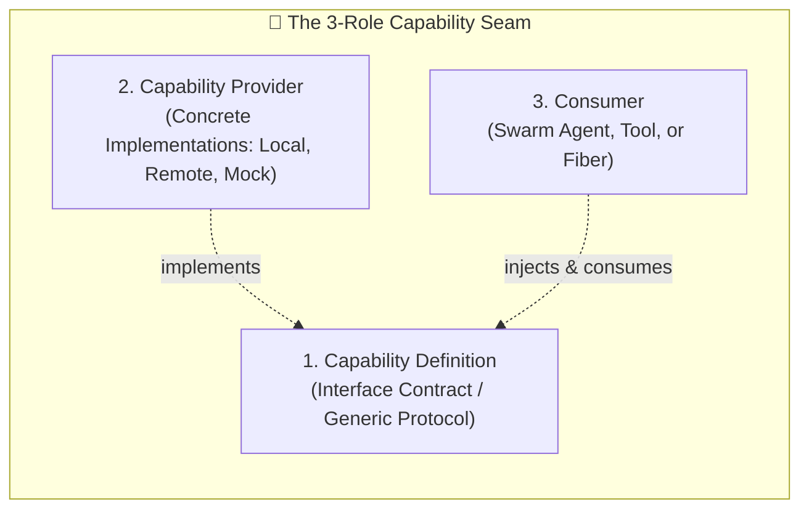

# Spatiotemporal Composability Standard (DeepSeek Harness & Cordis Pattern)

Architectural protocol governing dynamic runtime composition, reactive coeffects, and revertible effects across Kenbun.

Version: 1.0.0  
Origin: Grounded in *A Programming Paradigm for Spatiotemporal Composability* (Shi, Zhang, Cui) & DeepSeek Harness (`@deepseek-ai/dsh`).

---

## 1. The Core Philosophy

Traditional software architecture relies on **static composition**: providers, models, database endpoints, and tools are wired at import/boot time. Changing or recovering from a failure requires editing source code and restarting the process—wiping out live state.

**Spatiotemporal Composability** replaces static coupling with two formal dimensions:

| Dimension | Mechanism | Core Rule |
|---|---|---|
| **Temporal** (Lifecycle / Unwind) | **Revertible Effects** | Every context mutation registers a cleanup inverse. Teardown executes inverses in **LIFO (Last-In, First-Out)** order. Removing a parent cleanly cascades to children with zero leftovers. |
| **Spatial** (Dependencies / Wiring) | **Reactive Coeffects** | A consumer never imports a provider directly; it declares the capability contract it requires (`inject`). The `ContextEngine` watches provider state and automatically activates, refreshes, or degrades dependents. |

---

## 2. The 3-Role Capability Seam

Every capability in Kenbun MUST be separated into three distinct OOP roles:

1. **Service Definition (`CapabilityDefinition[T]`)**: Abstract protocol or schema defining the contract, method signatures, and promised semantics.
2. **Service Provider (`CapabilityProvider[T]`)**: Concrete implementations (e.g. `PostgresDbProvider`, `SqliteDbProvider`, `LmStudioProvider`, `GatewayProvider`). Providers expose health checks, priority, and metadata.
3. **Consumer**: The model-facing tool or swarm worker. Consumers interact strictly with the definition through the `ContextEngine`, completely agnostic to which provider satisfies it.

---

## 3. The 4 Non-Negotiable Laws of DSH Engineering

### Law 1: Zero Hardcoding (Dynamic Discovery)
- Never write hardcoded `if/else` or `switch/case` chains to select providers or capabilities.
- Providers register dynamically with the `ContextEngine` via typed definitions.
- The context engine resolves active providers at call time based on live health and precedence.

### Law 2: Clean Object-Oriented Architecture (OOP)
- Use typed Abstract Base Classes (`ABC`, `Generic[T]`), immutable definitions, and explicit lifecycle hooks.
- State machines must be inertial: transitions (`PENDING` → `ACTIVE` → `DEGRADED` → `DISPOSED`) run to completion before responding to new targets.

### Law 3: Revertible LIFO Cleanup
- Every registration yields a callable `EffectDisposer`. Calling the disposer restores the exact prior state.
- If a plugin or tool mount fails validation, the disposer is immediately executed—never leaving orphaned state in memory.

### Law 4: Edge Case & Cycle Safety
- **Circular Dependencies**: The context engine must detect dependency cycles across injected coeffects before execution and raise a structured `CircularDependencyError`.
- **Re-entrant Events**: Mutations triggered inside event listeners must be queued safely rather than causing recursive stack overflows.
- **Graceful Degradation**: If all providers for an injected coeffect fail, the fiber transitions to `DEGRADED` with observable telemetry, rather than raising uncaught runtime exceptions.

---

## 4. Verification & Testing

When adding or refactoring a DSH capability:
1. Verify 100% type annotations and AST syntax validity.
2. Run isolated unit tests asserting that:
   - Dynamic provider registration resolves the highest-priority healthy provider.
   - Provider failure automatically degrades or demotes to the fallback provider.
   - Calling the disposer removes the provider and notifies dependents.
   - Circular coeffect injection is caught and rejected cleanly.
