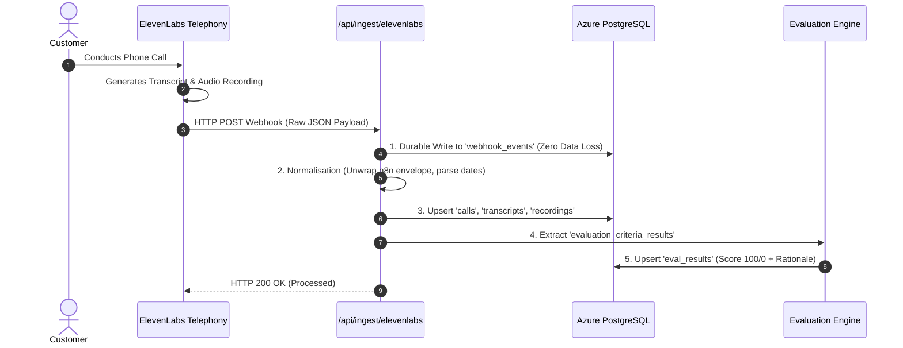

# 🏛️ Eko Veritas Architecture & Behavioral Evaluation Pipeline: Comprehensive Master Briefing

> **Target Audience:** System Architects, Product Leaders, and AI Engineers.  
> **Optimized For:** NotebookLM Deep Research Ingestion, Podcast Generation, and Technical Strategy.

---

## Executive Summary & System Philosophy

**Eko Veritas** is an autonomous, closed-loop Quality Assurance and AI Governance engine designed for enterprise voice agent fleets (e.g., ElevenLabs conversational agents handling customer phone calls).

In traditional call centers, human QA managers manually listen to less than $2\%$ of recorded calls to grade agent compliance. Eko Veritas flips this paradigm:
1. **$100\%$ Evaluation Rate:** Every single inbound and outbound phone call is programmatically evaluated against deterministic behavioral criteria within seconds of call completion.
2. **Self-Healing Prompt Loop:** When a customer complains or a failure mode is detected, the platform automatically diagnoses which sentence in the agent's system prompt caused the error, drafts a surgical prompt patch, and invents a new evaluation rule so that mistake can never happen again undetected.
3. **Enterprise Defense & Multi-Tenancy:** Strict Row-Level Security (RLS) guarantees complete tenant isolation, preventing cross-account contamination across voice agent fleets.

```
                  ┌────────────────────────────────────────┐
                  │    1. LIVE TELEPHONY & WEBHOOKS        │
                  │   ElevenLabs Voice Agent Phone Call    │
                  └───────────────────┬────────────────────┘
                                      │
                                      ▼
                  ┌────────────────────────────────────────┐
                  │    2. INGESTION & NORMALISATION        │
                  │   /api/ingest/elevenlabs (Raw Store)   │
                  │   Extracts Audio, Transcript & Metadata│
                  └───────────────────┬────────────────────┘
                                      │
                                      ▼
                  ┌────────────────────────────────────────┐
                  │    3. BEHAVIORAL RULE EVALUATION       │
                  │   Evaluates 'eval_criteria' against    │
                  │   transcript using LLM-as-a-Judge      │
                  └───────────────────┬────────────────────┘
                                      │
                                      ▼
                  ┌────────────────────────────────────────┐
                  │    4. DETERMINISTIC SCORING ALGORITHM  │
                  │   Pass = 100 Score | Fail = 0 Flagged  │
                  │   Updates Fleet Pass Rate & Outliers   │
                  └───────────────────┬────────────────────┘
                                      │
                                      ▼
                  ┌────────────────────────────────────────┐
                  │    5. SELF-HEALING CALIBRATION LOOP    │
                  │   Claude analyzes Customer Complaints  │
                  │   Drafts Surgical Prompt Revisions     │
                  └────────────────────────────────────────┘
```

---

## 1. What is a "Behavioral Rule" (Evaluation Criterion)?

A **Behavioral Rule** (persisted in PostgreSQL table `eval_criteria`) is a specific, objective test applied to a phone call transcript.

### Analogy: The QA Inspector's Checklist
Instead of giving a vague rating like *"Was the call good?"*, a Behavioral Rule asks a clear, verifiable question:
* *Rule 1 (Phone Number Formatting):* *"Did the agent repeat back the customer's phone number as local digits without saying '+1'?"*
* *Rule 2 (Delivery Address):* *"Did the agent explicitly ask the customer for their street address and apartment number before confirming the order?"*
* *Rule 3 (Return Policy Disclosure):* *"If the caller asked about refunds, did the agent send the return link via text instead of reciting the legal policy verbally?"*

### Schema Representation
| Column | Type | Purpose |
|---|---|---|
| `id` | `UUID` | Unique identifier of the criterion. |
| `tenant_id` | `UUID` | Enforces multi-tenant ownership. |
| `name` | `VARCHAR` | Human-readable title (e.g. `Address Verification`). |
| `prompt_instruction` | `TEXT` | The exact boolean question answered by the AI Evaluator from the transcript alone. |
| `elevenlabs_criterion_id` | `VARCHAR` | External mapping ID for ElevenLabs sync. |

---

## 2. Where Anthropic AI (Claude) is Used in the Architecture

Anthropic Claude AI is deployed across **three strategic sub-systems**:

### Sub-System A: The Self-Healing Complaint Diagnoser (`feedback-actions.ts`)
* **Trigger:** A customer calls in or emails: *"Your bot kept quoting the wrong pricing for large pizzas!"*
* **Input to Claude:**
  1. The raw customer complaint body.
  2. The voice agent's current active `system_prompt`.
* **Claude's Diagnostic Task:**
  1. Pinpoints the exact line in the system prompt responsible for the behavior.
  2. Drafts a minimal, surgical prompt revision (`suggested_revision`).
  3. Formulates a brand new evaluation criterion (`proposed_eval_criterion`) so all future calls are checked for this specific issue.
* **Output:** Stored in table `prompt_revisions` in `'pending'` state awaiting human approval.

### Sub-System B: The Instruction Polisher (`voice-agents/actions.ts`)
* **Trigger:** An administrator types a rough evaluation rule (e.g. *"make sure the agent is polite and gets the email"*).
* **Claude's Task:** `claude-3-5-sonnet` transforms vague instructions into objective, binary questions that can be scored $100\%$ accurately from transcripts alone.

### Sub-System C: The Transcript Judge (LLM Evaluator Engine)
* **Trigger:** A call completes and arrives via webhook.
* **Claude's Task:** Reads the raw multi-turn conversation and scores each active criterion, returning a boolean verdict along with written reasoning (`ai_reasoning`).

---

## 3. End-to-End Ingestion Pipeline (`/api/ingest/elevenlabs`)



### The "Durable Capture First" Security Property
* **Problem:** If a cloud webhook fails to parse due to unexpected JSON schemas, traditional systems drop the packet.
* **Eko Solution:** The raw string is written into `webhook_events` **before** parsing. If normalisation fails, the payload is preserved forever and can be replayed at any time via `/api/admin/replay-orphans`.

---

## 4. The Deterministic Pass/Fail Scoring Algorithm

In `src/lib/ingest/elevenlabs.ts:L298-332`, evaluation scoring is mathematical and strictly deterministic:

$$\text{Verdict Mapping} = \begin{cases} 
\text{Score} = 100, \quad \text{is\_flagged} = \text{false} & \text{if verdict} \in \{\text{"pass"}, \text{"success"}, \text{"passed"}, \text{"true"}\} \\ 
\text{Score} = 0, \quad \text{is\_flagged} = \text{true} & \text{if verdict} \in \{\text{"fail"}, \text{"failure"}, \text{"error"}, \text{"false"}\} \\ 
\text{SKIPPED} & \text{if verdict} \in \{\text{"unknown"}, \text{"n/a"}\}
\end{cases}$$

### Fleet Pass Rate Formula
$$\text{Fleet Pass Rate (\%)} = \left( \frac{\sum \text{Evaluations with Score } 100}{\text{Total Scored Evaluations}} \right) \times 100$$

* If a call passes 4 out of 5 criteria, its individual call compliance is **$80\%$**.
* The 1 failed evaluation is flagged with the AI's explanation (`ai_reasoning`), immediately alerting managers on the Calls & Feedback dashboard.

---

## 5. Where Everything is Located in the Web App UI

### 1. Voice Agents Studio (`/voice-agents`)
* **URL Route:** `http://localhost:3000/voice-agents`
* **Tab: "Evaluation Criteria"**:
  - Found on the right panel when an agent is selected.
  - This is the **Behavioral Rules Manager**.
  - Shows the list of rules tested against this agent, with add/edit/delete and Claude-powered prompt polishing.
* **Tab: "Directives"**:
  - In-studio feedback loop to attach reviewer critiques directly to the persona.
* **Tab: "Revision Queue"**:
  - Located in the top header tab.
  - The Human-in-the-Loop approval desk where Claude's suggested prompt fixes and new evaluation rules are reviewed.

### 2. Calls & Feedback Hub (`/call-telemetry`)
* **URL Route:** `http://localhost:3000/call-telemetry`
* **The Calls Table & Inspection Drawer**:
  - Lists every ingested phone call.
  - Clicking any call opens the **Call Inspection Drawer**, displaying:
    1. The verbatim multi-turn **Transcript**.
    2. The **Evaluated Rules Checklist**: Each rule displays a Green Pass (`100`) or Red Flagged Fail (`0`), plus the AI Judge's written reasoning.
* **Top Button: "Add Agent Feedback"**:
  - Manual feedback intake form to report caller complaints with optional Call Context Anchors.

### 3. Fleet Overview Dashboard (`/fleet-overview`)
* **URL Route:** `http://localhost:3000/fleet-overview`
* **Fleet KPI Cards**:
  - Displays overall **Fleet Pass Rate**, total evaluated calls, and historical compliance charts.

---

## 6. Where Everything is Located in the Codebase

| Feature Area | Source Code Path | Key Function / Symbol |
|---|---|---|
| **Webhook Ingestion** | `src/app/api/ingest/elevenlabs/route.ts` | `POST()` |
| **Normalisation & Eval Extraction** | `src/lib/ingest/elevenlabs.ts:L280-L333` | `normaliseEvent()` |
| **Self-Healing AI Diagnoser** | `src/app/(dashboard)/call-telemetry/feedback-actions.ts:L207-L298` | `diagnoseAndQueue()`, `addFeedback()` |
| **Instruction Polisher** | `src/app/(dashboard)/voice-agents/actions.ts:L644-L689` | `polishCriterionInstructions()` |
| **Reconciliation Server Action** | `src/app/(dashboard)/voice-agents/actions.ts:L709-L848` | `reconcileElevenLabsAgents()` |
| **Voice Agents Studio UI** | `src/app/(dashboard)/voice-agents/voice-agents-client.tsx` | `VoiceAgentsClient` |
| **Calls & Feedback Hub UI** | `src/app/(dashboard)/call-telemetry/call-telemetry-client.tsx` | `CallTelemetryClient` |
