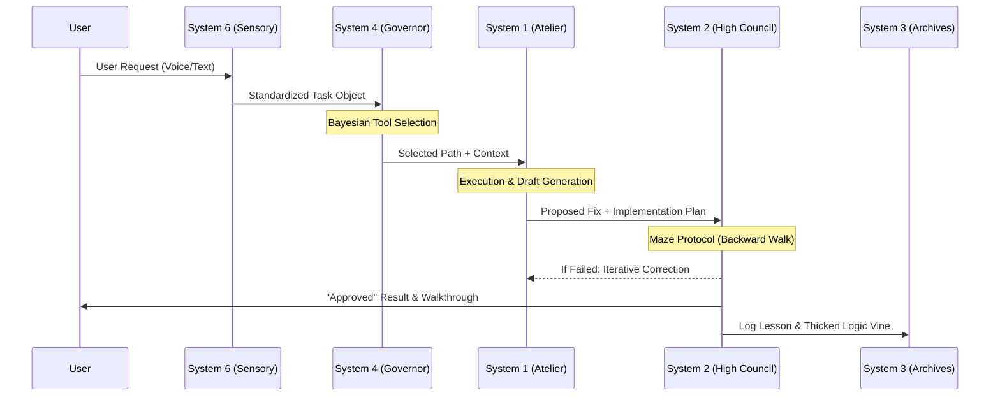

---

## 🗺️ 1. End-to-End Logic Flow (The 5-Blade Fan)



---

## 💻 2. Logic Flow: Code Example

Here is a simplified look at the **`orchestrate`** logic that powers the swarm:

```python
async def orchestrate_task(user_prompt):
    # 1. ROUTING (System 4)
    room = router.get_strategy_path(user_prompt) 
    
    # 2. CONTEXT PRUNING (System 3)
    # Only search the Archives relevant to the Room
    context = await knowledge_manager.search(user_prompt, room=room)
    
    # 3. EXECUTION (System 1)
    # Generate the draft fix in the Studio
    draft_fix = await atelier.generate_fix(user_prompt, context)
    
    # 4. MAZE PROTOCOL (System 2)
    # Backward Walk verification
    is_solid = maze_protocol.backward_verify(draft_fix, project_root)
    
    if not is_solid:
        # Self-correcting loop
        draft_fix = await atelier.refine(draft_fix, maze_errors)
    
    # 5. FINAL SIGN-OFF
    return audit_chamber.approve(draft_fix)
```

---

## 📂 3. The Global File & Folder Glossary

### 🏗️ Root Directory
*   **`server.py`**: The "Heartbeat." Exposes the MCP tools to your IDE.
*   **`orchestrator.py`**: The "Brain." Coordinates all systems to solve a task.
*   **`STRUCTURE.md`**: The technical "Source of Truth."
*   **`SYSTEM_MAP.md`**: The "Memory Palace" visual anchor.
*   **`POST_MORTEM.md`**: The "Experience Log" of all past failures.

### 🧠 `tools/strategy/` (System 4)
*   **`decision_logic.py`**: Calculates the "Margin of Confidence" for routing.
*   **`token_governor.py`**: Monitors your budget so you don't overspend on Cloud AI.
*   **`strategy_manager.py`**: Manages the Bayesian $(\alpha, \beta)$ weights.

### 🛡️ `tools/audit/` (System 2 & 2c)
*   **`supervisor_agent.py`**: The Lead Auditor. Manages the high-fidelity review.
*   **`guardrail_agent.py`**: The Security Guard. Fast, deterministic checks.
*   **`ensemble_audit.py`**: The Consensus Engine. Multi-model voting logic.
*   **`ui_designer.py`**: The Aesthetic Enforcer. Guarantees premium design.

### 📖 `tools/memory/` (System 3)
*   **`knowledge_manager.py`**: Bridge to ChromaDB.
*   **`code_indexer.py`**: Breaks your code into semantic "Vines."
*   **`chroma_db_connect.py`**: Handles the network bridge to the Remote PC.

### 🛠️ `tools/utils/` (The Toolkit)
*   **`maze_protocol.py`**: The script that walks the logic backwards.
*   **`backtracker.py`**: The "Undo" button for your codebase.
*   **`sync_to_pc.py`**: Syncs local changes to the Remote PC.

### 🩺 `brain_health/` (The Lab)
*   **`BENCHMARKS.json`**: Real-world performance data (Latency/Accuracy).
*   **`test_brain_health.py`**: Automated stress-test suite for core logic.

---

## 🛰️ 1. The Core Philosophy: "Logical Density"
On limited hardware, brute force is the enemy. Kenbun is built on **Logical Density**—the idea that a small, highly-specialized model guided by a rigid logical framework (The Maze) is more powerful than a massive, unguided model.

### The "Duality" Workflow:
The system is designed for the **Augmented CTO**—an architect who builds in the physical world and the digital one. It minimizes "Cognitive Switching Cost" by automating the heavy lifting of security, auditing, and documentation.

---

## 🧠 2. The Neural Hierarchy (The 6 Systems)

Kenbun operates across six distinct logical layers:

### System 6: Sensory (The Entrance)
*   **Role**: Ingestion of raw signals (Voice, Text, Terminal).
*   **Tech**: Telegram API + Gemini 3 (Transcription).
*   **Mechanism**: Converts messy human intent into structured "Proto-Tasks."

### System 1: Execution (The Atelier)
*   **Role**: Rapid drafting and sandboxed execution.
*   **Tech**: Docker + Python/Node Sandbox.
*   **Mechanism**: Runs code in isolation to verify it doesn't "break the world" before System 2 sees it.

### System 4: Strategy (The Governor)
*   **Role**: Deciding which tool to use and how much "energy" (tokens) to spend.
*   **Tech**: Bayesian Thompson Sampling + SQLite.
*   **Mechanism**: Uses past success/failure weights to pick the most efficient path.

### System 2/2c: Audit (The High Council)
*   **Role**: Deep security review and logic verification.
*   **Tech**: Multi-model Ensemble (Gemma, Llama, Phi).
*   **Mechanism**: The **Maze Protocol**. Traces code backwards from output to input to ensure no logical holes.

### System 3: Memory (The Archives)
*   **Role**: Permanent storage of experience.
*   **Tech**: ChromaDB (Vector) + Obsidian (Knowledge).
*   **Mechanism**: Hierarchical RAG. Links small "child" snippets to large "parent" architectural rules.

### System 5: Reflection (The Observatory)
*   **Role**: Learning from mistakes.
*   **Tech**: Post-Mortem Analysis.
*   **Mechanism**: Every fix is "reflected" upon. If a fix worked, the system's Bayesian confidence increases. If it failed, it creates a `POST_MORTEM.md` entry.

---

## 🗺️ 3. The Memory Palace (Spatial Rooting)

We do not search files; we **navigate rooms**.
*   **Sensory Hall**: Where you are now (The Prompt).
*   **Execution Studio**: Where the work happens.
*   **Audit Chamber**: Where the logic is judged.
*   **The Archives**: Where the knowledge is buried.
*   **The Observatory**: Where the stats are watched.

**Algorithm**: By tagging every search query with a "Room Metadata" filter, we reduce vector DB noise by **90%**, ensuring the AI never gets "lost" in a 100,000-line codebase.

---

## 🌀 4. The Maze Protocol (Backward Verification)

When a bug occurs, the system initiates a **Maze Loop**:
1.  **Entrance**: The initial error signal.
2.  **The Solve**: The proposed fix.
3.  **The Backward Walk**: 
    - Trace the variable flow backwards.
    - Verify that every import has a path.
    - Check that the `sys.path` wasn't corrupted.
4.  **The Exit**: A verified, production-ready solution.

---

## ⚙️ 5. Hardware Optimization (The Stable Orbit)

To run **Gemma 26B** and smaller models on local GPUs:
*   **Context Management**: 10,896 token limit with a **Rolling Window**.
*   **GPU Offloading**: 19-layer split for maximum throughput.
*   **Inference Gating**: Only 1 concurrent task to prevent VRAM spikes.
*   **Model Tiering**:
    - **4B/9B Models**: Fast, routine tasks (15s latency).
    - **26B+ Models**: Complex, structural tasks (60s+ latency).

---

## 📡 6. The Multi-Tier Fallback Engine

If the local PC or the network stalls:
1.  **Local Ensemble**: Tries to find a consensus among 3 local models.
2.  **Local Senior**: Escalates to the heavy-weight 26B model in LM Studio.
3.  **Cloud Bridge**: If latency exceeds 90s, the system auto-switches to **Gemini 1.5 Pro** via encrypted API.
4.  **Local Recovery**: Once the network stabilizes, it syncs the cloud findings back to the local Archives.

---

## 🛡️ 7. Maintenance Mandates
1.  **Update STRUCTURE.md**: Every new file is a new "Vine."
2.  **Audit before Approved**: No task is complete without a System 2 Sign-Off.
3.  **Root the Fixes**: Every solution must be saved to the Hivemind for future recall.
