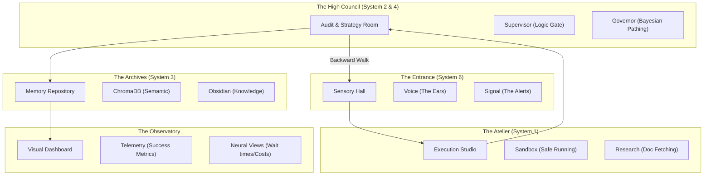

# 🏛️ Kenbun: The Memory Palace (SYSTEM_MAP)

This document is the **Spatial Root** of the codebase. Instead of a list of files, we view the system as a physical layout. This reduces cognitive load and allows the AI to "navigate" the logic via spatial anchors.

## 🗺️ The Five Rooms (The 5-Blade Fan)

---

## 🚪 Room Details & Anchors

### 1. The Sensory Hall (The Entrance)
*   **Logic Anchor**: `tools/core/native_ears.py`
*   **Spatial Context**: This is where signals first hit the "vine". It’s loud, messy, and requires "Gating" (System 4) to clean.
*   **Trigger**: "The 5-Blade Fan" — A reminder of the 5 systems that must all be "spinning" for the swarm to be air-worthy.

### 2. The Execution Studio (The Atelier)
*   **Logic Anchor**: `tools/execution/sandbox_runner.py`
*   **Spatial Context**: A sterile, isolated workspace. This is where tools are sharpened and code is "test-fitted" before being presented to the High Council.

### 3. The Audit Room (The High Council)
*   **Logic Anchor**: `tools/audit/supervisor_agent.py`
*   **Spatial Context**: The most secure part of the palace. No code leaves this room without a **Maze Protocol** (Backward Verification) stamp.
*   **Mechanism**: The Bayesian Governor sits here, deciding which path to take.

### 4. The Memory Repository (The Archives)
*   **Logic Anchor**: `tools/memory/knowledge_manager.py`
*   **Spatial Context**: Infinite shelves of past failures and successes. Every "Correction" is logged here to thicken the logic vine.

### 5. The Observatory (The View)
*   **Logic Anchor**: `tools/dashboard/`
*   **Spatial Context**: A glass-walled room looking out over the entire operation. It translates raw numbers into "Neural Landscapes".

---

## 🧭 Navigation Mandate
When the AI or the Human is "lost," they must return to the **Sensory Hall** and walk the path forward through the **Atelier** to the **High Council**. If a bug is found, the **Maze Protocol** is initiated to walk the path backwards.
