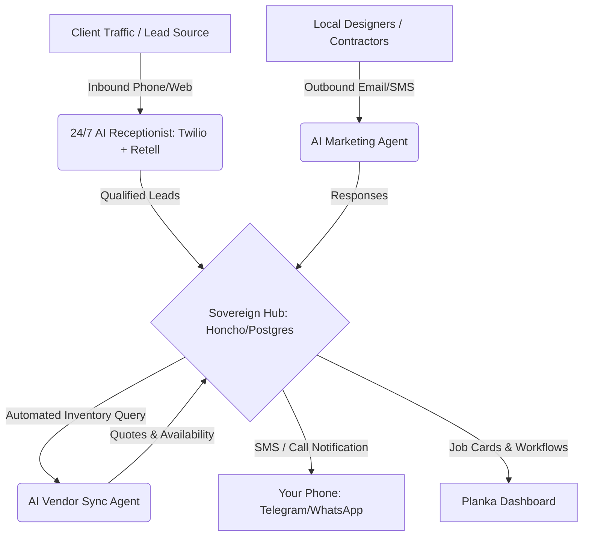

# CRG Flooring: Vertical Scaling & 24/7 Autonomous AI Back-Office Strategy

This document outlines the strategic diagnosis of **CRG Flooring** based on your journal entries and Alex Hormozi's business scaling principles. It provides an architectural blueprint for building an autonomous, 24/7 AI back-office that runs your marketing, manages clients, syncs with vendors, and keeps you updated.

---

## 1. Core Problem Diagnosis: The "Craftsman vs. CEO" Trap

Your journal entries reveal a classic bootstrapping challenge described by Alex Hormozi: **you are currently carrying massive management and operational debt** because the owner is also the primary laborer.

### Key Bottlenecks Identified:
1. **The Time-for-Money Constraint:** You spend your days doing high-quality physical labor ( clubhouse installations, nosing cuts, etc.) and driving. This physical exhaustion drains the cognitive energy required to build the business.
2. **The "Avoidance Loop" of Manual Sales:** Your "Daily 1" tasks (finding 3 contacts, sending follow-up texts to warm leads) are frequently missed. You naturally prioritize the physical craftsmanship (which is immediate and safe) over the outbound/admin tasks (which carry the risk of rejection).
3. **Fragile Lead Pipeline:** The "David's Mom" incident showed that relying on manual, one-off personal connections is high-friction. When a lead reschedules or cancels, the pipeline goes dry because there is no automated backup system.
4. **Lack of Vendor Coordination:** You are doing manual "plumbing" tasks (connecting emails, checking styles) instead of having an automated system map inventories and place orders.

---

## 2. Hormozi's Blueprint: Bootstrapping to Systemizing

According to the **"Four Paths to Mega Money"**, you are bootstrapping. In this path, the main advantage is that you retain **100% control and equity**, but the disadvantage is that it is the **slowest** path because you have to make the money to fund the growth machine.

To scale vertically without taking on outside capital (which would dilute your equity and force you to serve VCs), you must build a **"capital and operational reallocation machine"**. You must transition your role from **lead installer (Craftsman)** to **systems architect (CEO)**.

---

## 3. The 24/7 AI Back-Office Architecture

To free you from the back-office and let you focus either on high-value craftsmanship or pure strategy, we will deploy a containerized **Autonomous AI Agent Stack** running 24/7 on your sovereign infrastructure.

### Component A: 24/7 Inbound Client Agent (The AI Receptionist)
*   **Technology:** Twilio Phone Number + Retell AI / Vapi (Voice API) + Gemini Flash.
*   **How it works:** When a client calls your number or submits a form on `crgflooring.com`, the AI answers immediately. It qualifies the lead:
    *   Asks for square footage, type of flooring (LVP, hardwood, tile), location, and budget.
    *   Checks your Google Calendar/Planka schedule and books a walkthrough.
    *   Sends a professional confirmation text/email automatically.

### Component B: Outbound Marketing Agent (The B2B Growth Engine)
*   **Technology:** Python script + DuckDuckGo Search API + Resend (email delivery).
*   **How it works:** Runs nightly. 
    *   Scrapes local Google Maps/directories for local Interior Designers, General Contractors, and Real Estate Agents within a 50-mile radius.
    *   Drafts personalized outreach emails offering CRG Flooring as their go-to sub-contractor (offering prompt quotes and reliable nosing/niche cuts).
    *   Monitors replies. When a contractor replies, the AI classifies it and alerts you.

### Component C: Vendor Sync Agent (The Supply Chain Link)
*   **Technology:** Web scraping / API integrations with local flooring distributors.
*   **How it works:**
    *   When a client selects a style (e.g., specific LVP plank or wood species), the AI queries your local distributors' portals to check real-time stock levels, pricing, and transit times.
    *   It drafts a purchase order (PO) automatically and holds it in your dashboard for your one-click approval.

### Component D: The Executive Assistant (The Notification Ring)
*   **Technology:** Telegram Bot API / Twilio SMS.
*   **How it works:** Updates you 24/7. Instead of you checking dashboards, the AI pushes alerts to your phone:
    *   *SMS Alert:* *"CEO Alert: New lead qualified. David's mom estimated 600 sq ft LVP. Walkthrough scheduled Saturday at 10 AM. View details here: [Link]"*
    *   *Daily Briefing (6:00 PM):* A clean voice note or text summarizing the day's leads, vendor quotes, and tomorrow's installations.

---

## 4. Immediate Setup & Phased Implementation

To build this without disrupting your daily installations, we will execute in three phases:

### Phase 1: Lead Capture & Professional Presence (Now)
*   Deploy the simple **CRG Flooring Landing Page** (Minimum Viable Website) containing an interactive lead capture form.
*   Configure the **CORS-safe server relay** to forward form entries directly into your local database.

### Phase 2: CRM & Task Board Automation (Week 1)
*   Integrate Planka with your database: When a lead is captured, a task card is automatically created on your Planka "Leads" board with square footage and contact info.
*   Deploy a local Telegram Bot to send alerts directly to your phone when a card moves from "Lead" to "Estimate Scheduled".

### Phase 3: Outbound Scraping & Voice Agent (Week 2-3)
*   Write the Python crawler to harvest local designer contacts.
*   Set up the Twilio/Retell voice endpoint to handle inbound calls.
