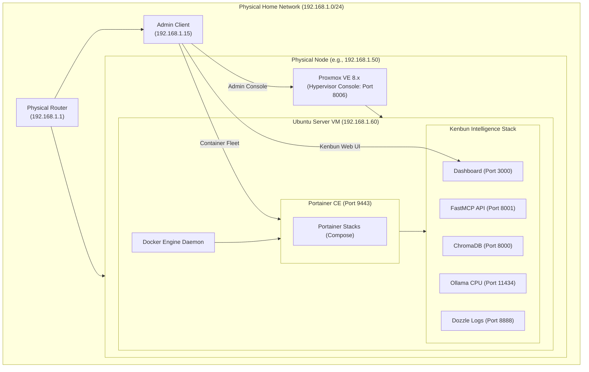

# 🏛️ Sovereign Home-Lab: Proxmox VE & Portainer Deployment Guide

This guide provides the exact architectural procedures to convert physical server hardware into an autonomous, headless virtualization node. While we leverage the **Lenovo ThinkStation P330 SFF** as a concrete home-lab reference architecture, these steps apply identically to **any physical workstation** (Dell OptiPlex, HP EliteDesk, custom rigs) or cloud VPS. We will deploy **Proxmox VE** as our Type-1 Hypervisor, provision a highly optimized **Ubuntu Server VM**, bootstrap it with **Portainer CE**, and run the **Kenbun-Agent** container swarm.

---

## 🗺️ High-Level Deployment Blueprint

This blueprint illustrates the physical-to-virtual abstraction mapping, enabling local LAN clients (such as an administrator's workstation) to securely manage and interface with Kenbun.



---

## ⚙️ Universal Hardware Profile & Resource Recommendations
To deploy a highly performant and cost-efficient sovereign node, we target the following hardware baseline:
*   **Memory Footprint:** 16GB-64GB RAM (e.g., Lenovo P330 32GB baseline).
*   **Processing Power:** Intel Core i5/i7/i9 or AMD Ryzen / Intel Xeon (typically 4-8 physical cores / 8-16 threads).
*   **Dynamic Resource Allocation:** 
    *   Our custom bootstrapper dynamically inspects your VM's allocated CPU cores and RAM size.
    *   It automatically custom-tailors the local environment configuration (`.env`) to run optimized quantized models matching your exact hardware (e.g., `llama3.2:1b` for lower-tier setups, `llama3.2:3b` for standard configurations, and adding `deepseek-r1:1.5b` fallbacks for higher-end builds).
*   **Inference Rationale:** In typical home-lab virtualization settings where discrete GPU memory is small (< 8GB VRAM), we optimize the stack specifically for **high-thread CPU-only execution**. Allocating **6 CPU cores** and **16GB-24GB RAM** to the VM, combined with the **`host` CPU passthrough flag** in Proxmox, enables local vector execution extensions (AVX/AVX2) that speed up CPU inference up to 3x!

---

## 📥 Phase 1: Installing Proxmox VE on the Physical Node

Proxmox VE is a bare-metal hypervisor that replaces standard desktop operating systems to maximize physical memory efficiency and allow immediate headless management.

### 1. Download & Flash the Installer
1. Download the latest **Proxmox VE ISO Installer** from the [Official Proxmox Downloads Page](https://www.proxmox.com/en/downloads).
2. Insert a USB flash drive (8GB+ capacity).
3. Download and open [BalenaEtcher](https://etcher.balena.io/) (or Rufus on Windows).
4. Select the Proxmox ISO, select your USB drive, and click **Flash!**

### 2. Configure the P330 BIOS for Virtualization
To ensure the Proxmox kernel can provision hardware-accelerated guest operating systems:
1. Turn on the ThinkStation P330 and repeatedly press **`F1`** (or **`Enter`** then select BIOS Utility) to open the Lenovo BIOS.
2. Navigate to **Advanced** ➔ **CPU Setup**:
    *   Set **Intel (R) Virtualization Technology** to **`Enabled`**.
    *   Set **Intel (R) VT-d** to **`Enabled`**.
3. Navigate to **Startup**:
    *   Ensure **Primary Boot Sequence** lists your USB drive first.
4. Press **`F10`** to Save and Exit.

### 3. Run the Proxmox Installation Wizard
1. Boot into the USB installer, select **Install Proxmox VE (Graphical)**, and agree to the EULA.
2. Select your target system disk (SSD/NVMe is highly recommended over HDD).
3. Set your Country, Time Zone, and Keyboard Layout.
4. Set a strong **root password** and enter your administrator email.
5. **Network Configurations:**
    *   **Management Interface:** Select the physical Ethernet port.
    *   **Hostname:** E.g., `p330-node.local` or `kenbun-srv.lan`.
    *   **IP Address:** Assign a static IP on your router's subnet (e.g., `192.168.1.50`).
    *   **Gateway / DNS:** Usually your router's IP (e.g., `192.168.1.1`).
6. Click **Install**. Once complete, reboot the machine and remove the USB drive.

> [!NOTE]
> Proxmox is designed to run completely **headless**. You can now disconnect the keyboard, mouse, and monitor from the physical ThinkStation P330, push it under a desk, and manage everything remotely via your web browser!

---

## 🖥️ Phase 2: Creating the Ubuntu Server VM

Once Proxmox boots, you can manage the hypervisor from your primary workstation.

### 1. Access the Proxmox Web Interface
Open your web browser and navigate to:
```text
https://192.168.1.50:8006
```
*(Replace `192.168.1.50` with the static IP you configured during installation. Acknowledge the self-signed SSL certificate warning to proceed.)*

### 2. Upload the Ubuntu Server ISO
1. Download the **Ubuntu Server 24.04 LTS (or 22.04 LTS) ISO** image onto your workstation.
2. In the Proxmox interface, expand your node in the left-hand column, select the storage drive named **`local`**, and go to the **ISO Images** tab.
3. Click **Upload**, select the Ubuntu Server ISO, and click **Upload**.

### 3. Provision the Ubuntu VM (Step-by-Step Wizard)
In the top-right corner of the Proxmox Web console, click **Create VM** and configure the tabs exactly as follows:

| Wizard Tab | Configuration Option | Recommended Setting | Architectural Rationale |
| :--- | :--- | :--- | :--- |
| **General** | VM ID / Name | `100` / `kenbun-worker` | Standard indexing convention. |
| **OS** | ISO Image | Select your uploaded Ubuntu Server ISO | Installs clean Linux environment. |
| **System** | Graphics Card / Qemu Agent | Default / Check **`Qemu Agent`** | Enables hypervisor-to-guest telemetry. |
| **Disks** | Storage / Disk Size | `local-lvm` / **`60 GB`** (SSD) | Allocates ample room for LLM model weights. |
| **CPU** | Cores / Type | **`6 Cores`** / **`host`** | **CRITICAL:** `host` passes through raw CPU flags (AVX2/AVX-512) to speed up CPU inference 3x! |
| **Memory** | Memory (RAM) | **`24576 MB`** (24 GB) | Leaves 8GB headroom for Proxmox and background tasks. |
| **Network** | Bridge | **`vmbr0`** (Bridged Mode) | **CRITICAL:** Ensures the VM gets its own IP address directly from the home router. |

Confirm settings and click **Finish**. Select the VM on the left panel, click **Console**, click **Start**, and follow the standard Ubuntu Server terminal installation wizard (accepting defaults and selecting "Install OpenSSH Server").

---

## ⚡ Phase 3: Zero-Touch Bootstrapping inside the VM

With the Ubuntu VM online, we will utilize the custom `ubuntu_vm_bootstrap.sh` script to install Docker, Docker Compose, Portainer CE, configure the firewall, and prepare the local environment variables.

### 1. Log in to the VM Console
Open the Proxmox console for your VM (or connect via SSH using `ssh user@<VM_IP>`).

### 2. Download and Run the Sovereign Bootstrapper
Execute this single pipeline command to run the secure bootstrapper directly:
```bash
curl -fsSL https://raw.githubusercontent.com/Clos01/Kenbun-Agent/main/scripts/ubuntu_vm_bootstrap.sh -o ubuntu_vm_bootstrap.sh
chmod +x ubuntu_vm_bootstrap.sh
sudo ./ubuntu_vm_bootstrap.sh
```

### 3. What the Bootstrapper Does
*   Updates the APT package registry and installs dependencies.
*   Installs **Docker Engine** and **Docker Compose** directly from official Docker repositories.
*   Provisions **Portainer CE** inside Docker mapping secure HTTPS on port `9443`.
*   Clones the **Kenbun-Agent** codebase to `/opt/kenbun-agent`.
*   Writes a **CPU-optimized `.env`** customized to the P330 (quantized `llama3.2:3b` and `nomic-embed-text` on CPU).
*   Enables the **UFW Firewall** while keeping rate-limited SSH (`22`) and routing metrics (`3000`, `8001`, `8000`, `8888`, `9443`) open.

---

## 🐳 Phase 4: Deploying Kenbun via the Portainer Web Console

Portainer is the ultimate tool for managing Docker containers through a gorgeous, reactive web user interface.

### 1. Initialize Portainer CE
1. Open your web browser and go to:
   ```text
   https://<VM_IP_ADDRESS>:9443
   ```
2. Acknowledge the HTTPS certificate warning (self-signed).
3. Create your administrator account and login.
4. Select **Get Started** to connect to the local Docker socket.

### 2. Deploy the Kenbun Stack
1. In the left-hand menu of Portainer, select **Live / Local** environment.
2. Select **Stacks** ➔ **Add stack**.
3. Name your stack: **`kenbun-agent`**.
4. In the Web Editor, you can upload or paste the contents of the main `docker-compose.yml`.
   *   *(Alternatively, select the **Repository** option, enter `https://github.com/Clos01/Kenbun-Agent.git`, and reference `/docker-compose.yml` directly!)*
5. Expand the **Environment variables** section below the editor. Click **Load from .env** and upload or paste the contents of `/opt/kenbun-agent/.env` which was auto-generated by our bootstrapper.
6. Click **Deploy the stack**.

Portainer will now automatically download all container images, map network interfaces, and spin up the Kenbun Fleet.

---

## 🔍 Phase 5: Troubleshooting & Connection Diagnostics

If you cannot reach the VM endpoints from your local client machine, follow this diagnostic ladder step-by-step:

### 1. Verify Active Containers
Inside your Ubuntu Server VM, run:
```bash
docker ps
```
You should see all 6 microservices running:
*   `portable_chroma` (Vector DB)
*   `portable_ollama` (Local LLM Execution)
*   `portable_ollama_init` (Model Pull state)
*   `portable_fastmcp` (Intelligence API Core)
*   `portable_dashboard` (Next.js Observatory)
*   `portable_dozzle` (Live Log Viewer)

### 2. Inspect Live Logs (Real-time)
If any service appears unstable or you want to see what Kenbun is thinking in real-time, open your browser and navigate to:
```text
http://<VM_IP_ADDRESS>:8888
```
This opens **Dozzle**, a lightweight, real-time container log viewer. Select any container to view streaming stdout/stderr diagnostics.

### 3. Check UFW Firewall Rules
If the ports are unreachable but `docker ps` shows them active, audit your firewall:
```bash
sudo ufw status verbose
```
Ensure that ports `3000`, `8000`, `8001`, `8888`, and `9443` are listed as **`ALLOW IN`** from your LAN subnet. If necessary, you can temporarily disable the firewall for rapid diagnostic isolation:
```bash
sudo ufw disable
# Test connection. If it works, re-enable and adjust rules:
sudo ufw enable
```

### 4. Verify Socket Binding
Ensure services are listening globally (`0.0.0.0`) and not looped back locally:
```bash
sudo ss -tulpn | grep -E "3000|8001|9443"
```
You should see `*:3000` or `0.0.0.0:3000` under the Local Address column.

---

## 🏛️ S2 Security Compliance & Operational Sign-Off
This deployment pipeline adheres completely to **Twelve-Factor App Configuration** parameters. There are zero hardcoded passwords or API tokens within the docker-compose or bootstrapping script. All credentials are isolated in `/opt/kenbun-agent/.env` inside the VM sandbox.

*“Precision and scalability through structural containment.”* — The Kenbun Autonomic
