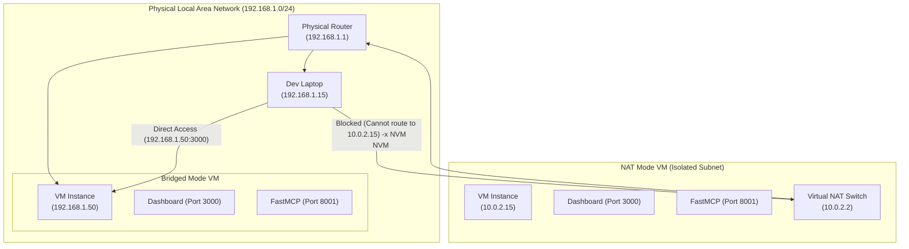

# Kenbun-Agent VM & Firewall Networking Guide

When hosting **Kenbun-Agent** inside a Virtual Machine (VM) using Hypervisors like **VirtualBox**, **Proxmox VE**, **VMware**, or **Hyper-V**, or on a cloud virtual private server (VPS), you might find that you cannot access the Dashboard (`http://localhost:3000`) or bind the FastMCP API (`http://localhost:8001`) from your local host machine.

This guide provides the exact network adaptation steps, firewall configurations, and diagnostic workflows to make your VM-hosted Kenbun-Agent containers fully visible across your local network or securely tunneled to your workstation.

---

## 🗺️ VM Network Topologies: Bridged vs. NAT

By default, most virtualization platforms provision new VMs using **NAT (Network Address Translation)**. Understanding how this isolates your agent is key to fixing accessibility issues.



### 1. Default NAT (Isolated Sandbox)
*   **How it works:** The hypervisor acts as a private router, assigning the VM a private IP (typically `10.0.2.15` or `192.168.56.x`).
*   **The Issue:** The VM can access the internet to download Docker images and pull LLM weights, but **your host laptop cannot reach the VM’s ports** directly because it sits behind the hypervisor's virtual network partition.
*   **Use Case:** Excellent for highly isolated testing, but makes multi-device or simple browser-to-dashboard communication tedious without set port-forwarding rules.

### 2. Bridged Adapter (Recommended for LAN Access)
*   **How it works:** The hypervisor bridges the VM’s virtual network interface directly to your host's physical network card (Wi-Fi or Ethernet).
*   **The Solution:** The VM broadcasts a DHCP request directly to your home or office router, obtaining a **native local IP** on the exact same subnet as your laptop (e.g., `192.168.1.50`).
*   **Result:** You can access the Next.js Dashboard, ChromaDB, and FastMCP SSE API from your laptop, mobile phone, or other local devices simply by replacing `localhost` with the VM's LAN IP!

> [!WARNING]
> **Security Warning:** Bridging a VM places it directly on the physical network. If your local network is untrusted (e.g., public coffee shop Wi-Fi or enterprise networks with strict rogue-DHCP rules), your VM and its exposed Docker ports will be visible to other devices on that network. In untrusted environments, stick to **NAT with SSH Port Forwarding** (detailed below).

---

## ⚙️ Hypervisor Configurations: Enabling Bridged Mode

To transition your VM to a Bridged Adapter, power down the VM and apply the following settings:

### 📥 VirtualBox
1. Open VirtualBox and select your VM.
2. Click **Settings** ⚙️ -> **Network**.
3. Under **Adapter 1**, change **Attached to:** from `NAT` to **`Bridged Adapter`**.
4. Under **Name:**, select your host machine’s active physical network interface (e.g., `en0: Wi-Fi` or `en1: Ethernet`).
5. Expand **Advanced** and ensure **Cable Connected** is checked.
6. Boot the VM.

### 🖥️ Proxmox VE
1. Open the Proxmox Web GUI.
2. Select your VM -> **Hardware** -> **Network Device (net0)**.
3. Click **Edit**.
4. Set **Bridge** to `vmbr0` (or your primary local bridge network interface).
5. Ensure the **VLAN Tag** is empty (unless routing through custom subnets).
6. Click **OK** and restart your VM.

### 🌀 VMware (Workstation / Fusion)
1. Select your VM and go to **Settings** -> **Network Adapter**.
2. Select **Bridged (Autodetect)** or select the specific active physical network card.
3. Click **Apply** and start the VM.

### 🟦 Hyper-V
1. Open the **Hyper-V Manager**.
2. In the Actions panel, click **Virtual Switch Manager**.
3. Select **External** virtual switch type and click **Create Virtual Switch**.
4. Bind it to your active physical network card and name it (e.g., `ExternalBridgeSwitch`).
5. Open your VM's settings -> **Network Adapter** -> Set **Virtual Switch** to `ExternalBridgeSwitch`.
6. Boot the VM.

---

## 🔍 Locating Your VM’s Local IP

Once booted in Bridged Mode, log into your VM terminal and run one of the following commands to find its new IP address:

```bash
# Option A: Get all active IP addresses on the machine (Recommended)
hostname -I

# Option B: Detailed interface layout (Look for eth0, enp0s3, or wlan0)
ip a
# OR
ip address show

# Option C: Legacy configuration utility
ifconfig
```

You should see an IP address corresponding to your router's subnet, usually starting with `192.168.x.x`, `10.x.x.x`, or `172.16.x.x` (e.g., `192.168.1.142`).

### Test Connection from Host Machine:
On your development laptop's terminal, test the connection to the VM:
```bash
ping -c 3 <VM_IP_ADDRESS>
# Example: ping -c 3 192.168.1.142
```
If you get successful ICMP replies, network bridging is functioning!

---

## 🛡️ Ubuntu UFW Firewall Configuration

Even with successful bridging, Ubuntu's default firewall (**UFW - Uncomplicated Firewall**) will block external incoming connections on Kenbun's container ports. You must explicitly configure the firewall to allow traffic through.

### 1. Exposing Kenbun-Agent Ports
Run the following commands on your VM to open the microservice ports:

```bash
# Allow Next.js Dashboard UI (Port 3000)
sudo ufw allow 3000/tcp comment 'Kenbun Dashboard'

# Allow FastMCP Server API & SSE Gateway (Port 8001)
sudo ufw allow 8001/tcp comment 'Kenbun FastMCP Server'

# Allow ChromaDB Vector Database (Port 8000)
sudo ufw allow 8000/tcp comment 'Kenbun ChromaDB Index'

# Allow Dozzle Real-time Container Log Viewer (Port 8888)
sudo ufw allow 8888/tcp comment 'Kenbun Dozzle Logs'
```

### 2. Restricting Port Access to Host Only (Strongly Recommended)
If you do not want to expose these ports to the entire local network, you can restrict access so that **only your development laptop's IP** can connect:

```bash
# Allow ONLY your host laptop IP (e.g., 192.168.1.15) to connect to port 3000
sudo ufw allow from 192.168.1.15 to any port 3000 proto tcp comment 'Kenbun Host Restricted'

# Allow host to connect to the FastMCP API
sudo ufw allow from 192.168.1.15 to any port 8001 proto tcp
```

### 3. Managing and Auditing UFW Firewall Status

```bash
# Inspect current rules and active status
sudo ufw status verbose

# Apply and reload updated rules instantly
sudo ufw reload

# Enable the firewall (if it was inactive)
sudo ufw enable

# Temporarily disable the firewall (Useful for rapid diagnostic isolation)
sudo ufw disable

# Reset UFW rules to absolute system defaults (Warning: deletes custom rules)
sudo ufw reset
```

---

## 🔌 Socket Port Binding & Listening Audits

If you have opened ports in UFW and configured Bridged network access, but connections still timeout, the problem may be that the service is binding locally (`127.0.0.1`) instead of globally (`0.0.0.0`) inside the VM.

### 1. Check Active Listeners on the VM
Run the `ss` or `netstat` tool to inspect what interfaces your services are binding to:

```bash
sudo ss -tulpn | grep -E "3000|8000|8001|8888"
# OR
sudo netstat -tulpn | grep -E "3000|8000|8001|8888"
```

#### Understanding the Output:
*   ❌ **Isolated Binding (`127.0.0.1:3000` or `localhost:8001`):** The service is listening **only** to internal loopback calls originating from inside the VM. External machines cannot reach it.
*   ✅ **Global Binding (`0.0.0.0:3000` or `*:8001`):** The service is listening on all network interfaces, making it accessible from your host machine over the bridged IP.

### 2. Resolving Bindings in Docker Compose
Kenbun-Agent uses Docker port mappings which automatically bind to all interfaces (`0.0.0.0`) by default:
```yaml
ports:
  - "3000:3000"  # This binds 0.0.0.0:3000 -> 3000
```
However, if you have customized your `docker-compose.yml` to specify loopback limits, ensure you haven't prefixed the ports with `127.0.0.1`:
```yaml
# ❌ Avoid this if you want LAN-wide access:
ports:
  - "127.0.0.1:3000:3000"

# ✅ Do this instead:
ports:
  - "3000:3000"
```

---

## 🔒 Secure Alternative: SSH Port Forwarding (Tunnelling)

If you are hosting Kenbun-Agent on a public cloud VM (AWS EC2, DigitalOcean, Linode) or on an untrusted shared network, **do not bridge or expose these ports using UFW.**

Instead, keep UFW closed on ports `3000`, `8000`, `8001`, and `8888`, and create a secure, encrypted **SSH Tunnel** from your local host machine:

```bash
# Securely map VM ports to your host localhost interfaces
ssh -N -L 3000:127.0.0.1:3000 -L 8001:127.0.0.1:8001 -L 8888:127.0.0.1:8888 user@<VM_IP_ADDRESS>
```

### Explaining the Parameters:
*   `-N`: Instructs SSH not to execute any remote shell command (perfect for forwarding ports without spawning a terminal session).
*   `-L 3000:127.0.0.1:3000`: Maps port `3000` on your *local machine's localhost* to port `3000` on the *VM's local interface*.

Once running, you can keep this terminal process active and access the Kenbun Dashboard securely by opening your host browser to **[http://localhost:3000](http://localhost:3000)**!

---

## 📋 VM Networking Diagnostic Checklist

If you still cannot connect, walk through this checklist in order:

1. [ ] **Ping Check:** Can your laptop successfully ping the VM IP? (If no, check the Bridged network adapter interface selections in your hypervisor).
2. [ ] **UFW Status:** Is UFW active? (`sudo ufw status`). If yes, run `sudo ufw disable` temporarily. If access works after disabling, your UFW rules are missing or incorrect.
3. [ ] **Docker Containers Running:** Are the Docker containers up? Run `docker compose ps` to ensure the containers are active.
4. [ ] **Binding Socket Check:** Run `sudo ss -tulpn | grep 3000` on the VM. Is it listening on `*:3000` or `0.0.0.0:3000`?
5. [ ] **Subnet Match Check:** Ensure your host laptop IP and VM bridged IP are on the same subnet (e.g., both are `192.168.1.x` with a netmask of `255.255.255.0`). If they are on different subnets (e.g. host is `192.168.1.15` and VM is `192.168.56.101`), your hypervisor is still using Host-Only or NAT adaptions instead of a bridged adaptor.
